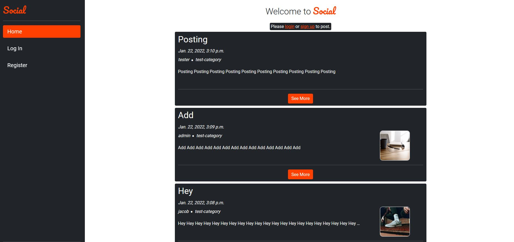
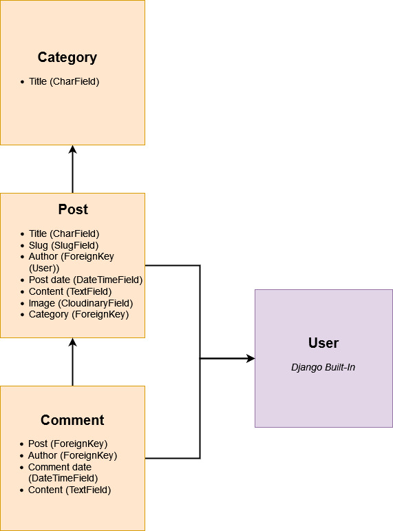

# Social



Social is a simple social media style web application, allowing users to share and engage with community content.

This is a Django-based, data-driven application that supports authentication and full CRUD functionality using PostgreSQL, hosted via Heroku.

[Project Live Link](https://ci-social.herokuapp.com/)

## UX/UI

### User Stories

#### Site User

-   As a Site User I can view a feed of posts so that I can easily read them.
-   As a Site User I can click on a post so that I can read it in full and view comments.
-   As a Site User I can view post comments so that I can see what the community is talking about.
-   As a Site User I can view the date a post or comment was made so that I know how recent it is.
-   As a Site User I can sign up for an account so that I can create and comment on posts.
-   As a Site User I can view a paginated post feed so that I can select which post to view.

#### Authenticated User

-   As a Site User I can create a post so that I can share it with others.
-   As a Site User I can add a category to my post so that others know what it relates to.
-   As a Site User I can add a comment to posts so that I can engage with the author.
-   As a Site User I can modify my posts so I can correct any errors made.
-   As a Site User I can modify my comments so I can correct any errors made.

#### Site Admin

-   As a Site Admin I can manage users' posts so that I can remove posts that break site policy.

### Database Schema / Models

3 custom models have been implemented in the design of Social. The models are:

-   Category
-   Post
-   Comment

The schema / relationship model can be seen below.



### Wireframes

As can be seen, the below wireframes differ slightly from the final deployed product, though these were the skeleton of the design.

-   [Post Feed View](readme/wireframes/post_feed.pdf)
-   [Post Modal](readme/wireframes/post_modal.pdf)
-   [Post Views](readme/wireframes/post_views.pdf)
-   [Login/Register](readme/wireframes/login_reg.pdf)

### Typography / Colour Scheme

Roboto is used for font across the application. Pacifico is used to style the brand font.

The primary colours used in the design are orange (#ff4000), grey (#212529) and white (#fff).

## Features

### Existing Features

-   Create Post
    -   Once authenticated, users are able to create posts to share with the community.
-   Add Category
    -   Users are able to add categories to their posts so others can see what the posts relate to.
-   Add Comment
    -   Once authenticated, users are able to leave comments on posted content.
-   View Post Feed
    -   A feed of posts filtered by date is available for users to scroll through.
-   Post View
    -   Each post can be viewed in full. Users are able to see the content in a dedicated view.
-   View Comments
    -   All comments for a post can be viewed via the post view page.
-   User Authentication
    -   Authentication is implemented to allow each user to sign up for an account, allowing user-exclusive actions on the site, such as posting and commenting.
-   Post/Comment Date
    -   Post/comment dates are displayed on each post/comment.
-   Post Feed Pagination
    -   Pagination is implemented to limit the amount of posts per page to 5 on the home page.
-   Post Modification
    -   Users can modify post content, providing they own the post.
-   Comment Modification
    -   Users can modify comment content, providing they own the comment.
-   User Confirmation
    -   Users are asked at all times to confirm update or delete operations.
-   User Feedback
    -   Users
-   Site Admin Modification
    -   Admin users are able to modify all content on the site to ensure it adheres to guidelines.

### Features to Implement in the Future

-   Social authentication.
-   Upvotes/downvotes for posts and comments.

## Technologies

### Languages Used

-   HTML
-   CSS
-   JavaScript
-   Python

### Frameworks/Libraries Used

-   [Django](https://www.djangoproject.com/)
    -   Used as the backend for this project.
-   [jQuery](https://jquery.com/)
    -   Used for minimising/optimising JavaScript used in the project.
-   [Boostrap](https://getbootstrap.com/)
    -   Used for styling templates.
-   [Git](https://git-scm.com/)
    -   Used for local version control to then push remotely.
-   [GitHub](https://github.com/)
    -   Used to store the project after pushing to Git.
-   [Heroku](https://dashboard.heroku.com/login)
    -   Used to host the application.
-   [Cloudinary](https://cloudinary.com/)
    -   Cloud service used to host and serve static files.
-   [Hover.css](https://ianlunn.github.io/Hover/)
    -   Used for navbar animation.

### Database

[PostgreSQL](https://www.postgresql.org/) was used for the databse. Information is passed to the database using Django's built-in database adapter.

## Testing

Information on testing can be found at [TESTING.md](readme/testing/TESTING.md)

## Deployment

This project is deployed to Heroku.

Steps for deployment:

-   Install Django and relevant dependencies.
-   Create new Django project with appropriate Procfile for Heroku.
-   Run:
    ```
    pip freeze --local > requirements.txt
    ```
-   Ensure all code is pushed to Github.
-   Navigate to Heroku, login, and click "create a new app".
-   Enter a unique name for the application, and select the appropriate region.
-   Add PostgreSQL 'hobby' database as a resource. The URL is automatically added to config vars.
-   During development, enable "DISABLE_COLLECTSTATIC = 1", and "DEBUG = TRUE". These must be disabled before final deployment.
-   Next, head to the "Deploy" tab and select Github as the deployment method.
-   Click the "Connect to Github" button and enter your details.
-   Search for your repository and select the appropriate one.
-   You can choose to either manually deploy or enable automatic deploys. In this case, I chose automatic deploys.

Cloning the repository:

-   Navigate to the project repository.
-   In the top right, click "Fork" to fork the repo.
-   After you have your own fork of the repo, click the "Code" button. A dropdown should appear.
-   Copy the SSH key and navigate to your local terminal.
-   Clone the repo using the below command:

```
$ git clone "HTTPS URL"
```

## Credit

All code/content is original unless stated.

Credit to [Ian Lunn](https://github.com/IanLunn/) for the code I used to animate the navigation elements.
