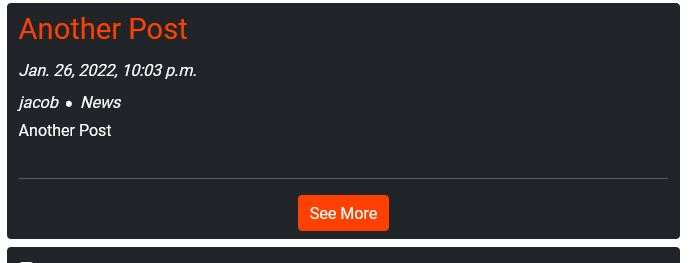

# Social - Testing Details

## Code Validation

All code has passed validation, returning no errors. See below for results.

-   HTML
    -   [index.html](validation/index.JPG)
    -   [post_view.html](validation/post_view.JPG)
    -   [edit_post.html](validation/edit_post.JPG)
    -   [edit_comment.html](validation/edit_comment.JPG)
    -   [delete_post.html](validation/delete_post.JPG)
    -   [delete_comment.html](validation/delete_comment.JPG)
    -   [login.html](validation/login.JPG)
    -   [logout.html](validation/logout.JPG)
    -   [signup.html](validation/signup.JPG)
-   CSS
    -   [style.css](validation/css.JPG)
-   JavaScript
    -   [script.js](validation/js.JPG)
-   Python
    -   [views.py](validation/views.JPG)
    -   [urls.py](validation/urls.JPG)
    -   [models.py](validation/models.JPG)
    -   [forms.py](validation/forms.JPG)
    -   [apps.py](validation/apps.JPG)
    -   [admin.py](validation/admin.JPG)

## Testing User Stories

-   As a Site User I can view a feed of posts so that I can easily read them.
    -   For both non-authenticated and authenticated users, the home page is a feed of previews of all posts.
    -   Each preview contains a maximum amount of characters, meaning users can quickly scan between each one.
    -   This feed is sorted by date, so the user views content in chronological order.

-   As a Site User I can click on a post so that I can read it in full and view comments.
    -   Any user may click to view a post in full.
    -   Both the title and the 'see more' button of the preview will take the user to the post view page.
    -   The user will be directed to a page displaying full post content.

-   As a Site User I can view post comments so that I can see what the community is talking about.
    -   Any user has the ability to view comments.
    -   Comments are available to view on the corresponding post view page.
    -   A total count of comments is visible at the top of all comments.

-   As a Site User I can view the date a post or comment was made so that I know how recent it is
    -   Posts have dates visible on both preview and post detail pages.
    -   Comment component included date.

-   As a Site User I can sign up for an account so that I can create and comment on posts.
    -   Users are able to sign up for accounts to allow member-specific actions.
    -   If a user is not currently authenticated, the navbar will show options to log in or sign up.
    -   If a user is not currently authenticated, they will be prompted to either log in or sign up before being able to post or comment.

-   As a Site User I can view a paginated post feed so that I can select which post to view
    -   The home page (post feed) is paginated.
    -   Once there are 5 posts displayed, the pages will paginate.
    -   In case of a large mass of posts, this will make it easier for users to digest.

-   As a Site User I can create a post so that I can share it with others.
    -   Authenticated users may create posts to be shared on Social.
    -   'Create Post' button at the top of the home page will trigger a modal, allowing the post creation.

-   As a Site User I can add a category to my post so that others know what it relates to.
    -   Users have a choice of multiple categories to add to their posts.
    -   Categories can be viewed on post previews and on full post details.

-   As a Site User I can add a comment to posts so that I can engage with the author.
    -   Once authenticated, users are able to leave comments on posts.
    -   'Add Comment' button is visible to authenticated users on the post detail page.
    -   On click, 'Add Comment' will trigger a modal, allowing the user leave their message.

-   As a Site User I can modify my posts so I can correct any errors made.
    -   Users have the ability to edit their posts.
    -   If a user owns a post, an 'edit' icon will be available to them.
    -   'Edit' icon will direct them to a page where they can update their post.
    -   User has the option to return to post page instead of going ahead with update.

-   As a Site User I can modify my comments so I can correct any errors made.

    -   Users have the ability to edit their comments.
    -   If a user owns a comment, an 'edit' icon will be available to them.
    -   'Edit' icon will direct them to a page where they can update their comment.
    -   User has the option to return to post page instead of going ahead with update.

-   As a Site Admin I can manage users' posts so that I can remove posts that break site policy.
    -   Using the Django admin panel, admin users are able to modify posts and comments where needed.
    -   Full CRUD operation is avaiable from the admin panel.

